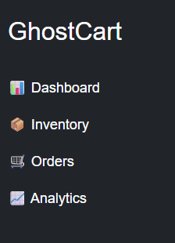
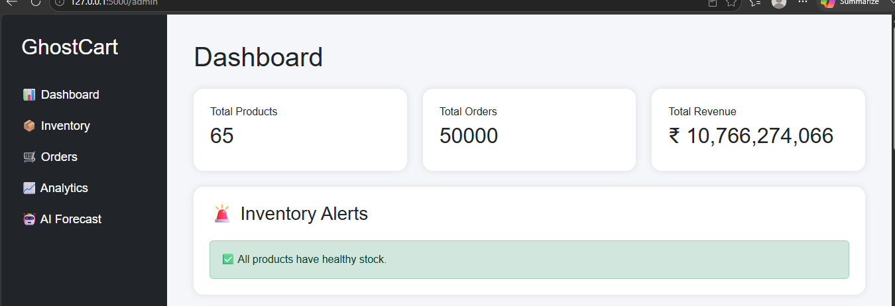
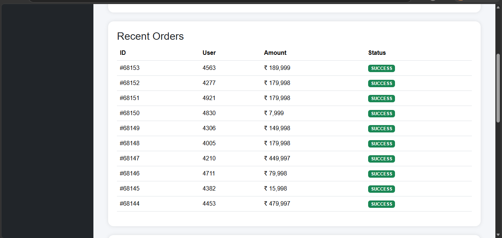
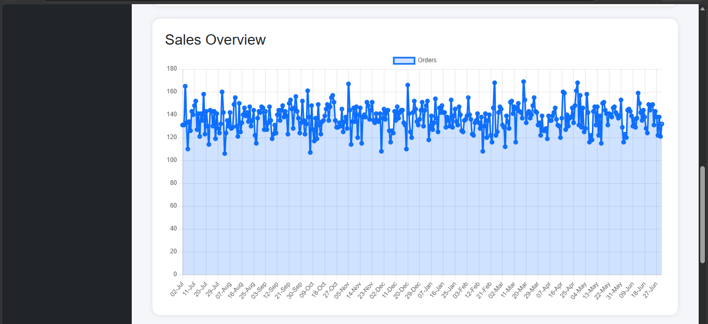
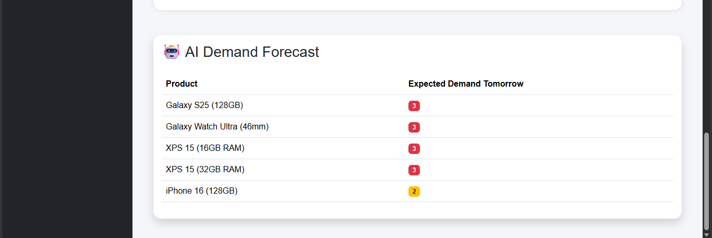
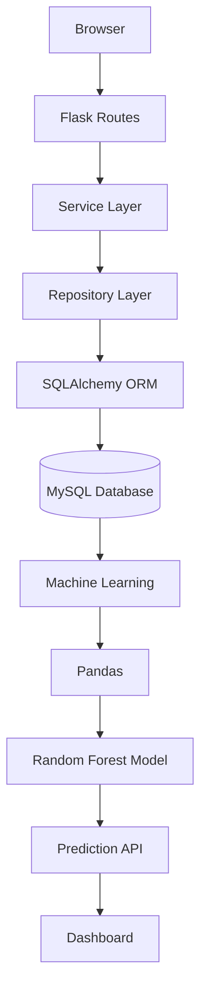

# 👻 GhostCart


> **AI-Powered Inventory Management System built with Flask, MySQL, and Machine Learning**

GhostCart is a full-stack inventory management system designed to simulate a real-world e-commerce backend. It combines inventory management, analytics, REST APIs, and machine learning to help businesses monitor stock levels and predict future product demand.

---
## ✨ Features

### 📦 Inventory Management
- Product CRUD operations
- Stock management
- Reserved stock tracking
- Low stock alerts

### 🛒 Order Management
- Checkout system
- Order history
- Order items
- Revenue calculation

### 📊 Analytics Dashboard
- Total Products
- Total Orders
- Total Revenue
- Sales Overview Chart
- Recent Orders
- Inventory Alerts

### 🤖 AI Demand Forecast
- Random Forest Regression (Scikit-learn)
- Demand prediction API
- Dashboard integration
- Predicts expected product demand

### 🧪 Data Generation
- 1,000 realistic users
- 65 products
- 50,000 orders
- Automated database seeding

---

## 🛠 Tech Stack

### Backend
- Python
- Flask
- SQLAlchemy
- MySQL

### Frontend
- HTML
- CSS
- Bootstrap 5
- JavaScript
- Chart.js

### Machine Learning
- Pandas
- Scikit-learn
- Joblib

### Tools
- Git
- GitHub
- VS Code

---

## 📁 Project Structure

```text
GhostCart
│
├── app/
│   ├── analytics/
│   ├── checkout/
│   ├── common/
│   ├── ml/
│   ├── orders/
│   ├── products/
│   ├── users/
│   ├── static/
│   └── templates/
│
├── scripts/
├── stress_test/
├── migrations/
├── docs/
│
├── run.py
├── requirements.txt
└── README.md
```

---

## 📸 Screenshots

## Sidebar


## 📸 Dashboard



## 📦 Orders



## 📈 Analytics



## 🤖 AI Forecast


---

## 🚀 Installation

### Clone Repository

```bash
git clone https://github.com/YOUR_USERNAME/GhostCart.git
```

```bash
cd GhostCart
```

### Create Virtual Environment

```bash
python -m venv venv
```

### Activate

Windows

```bash
venv\Scripts\activate
```

Linux/Mac

```bash
source venv/bin/activate
```

### Install Dependencies

```bash
pip install -r requirements.txt
```

### Configure Environment

Create a `.env` file:

```env
SECRET_KEY=your_secret_key

DB_HOST=localhost
DB_PORT=3306
DB_USER=root
DB_PASSWORD=your_password
DB_NAME=ghostcart
```

### Run Migrations

```bash
flask db upgrade
```

### Seed Database

```bash
python scripts/seed_database.py
```

### Train AI Model

```bash
python -m app.ml.train
```

### Run Application

```bash
python run.py
```

---

## 📡 API Endpoints

| Method | Endpoint | Description |
|---------|----------|-------------|
| GET | `/products` | Get all products |
| POST | `/products` | Create product |
| PUT | `/products/<id>` | Update product |
| DELETE | `/products/<id>` | Delete product |
| POST | `/checkout` | Checkout |
| GET | `/dashboard` | Dashboard JSON |
| GET | `/admin` | Admin Dashboard |
| GET | `/analytics/orders-chart` | Sales Chart |
| GET | `/analytics/low-stock` | Low Stock Alerts |
| GET | `/analytics/predict` | AI Demand Prediction |

---

## 🤖 Machine Learning Pipeline

```
Orders
      │
      ▼
MySQL
      │
      ▼
SQLAlchemy
      │
      ▼
Pandas
      │
      ▼
Feature Engineering
      │
      ▼
Random Forest Regressor
      │
      ▼
model.pkl
      │
      ▼
Prediction API
      │
      ▼
Dashboard
```

---
## 🏗️ System Architecture




## 📈 Future Improvements

- Multi-item orders
- JWT Authentication
- Docker support
- CI/CD pipeline
- Email notifications
- Product recommendation system
- Time-series demand forecasting

---

## 👩‍💻 Author

**Tanishka Kuwar**

Computer Engineering Student

Python Backend Developer | AI/ML Enthusiast

GitHub: https://github.com/tanishka-kuwar

---

## ⭐ If you found this project useful

Give this repository a ⭐ on GitHub!