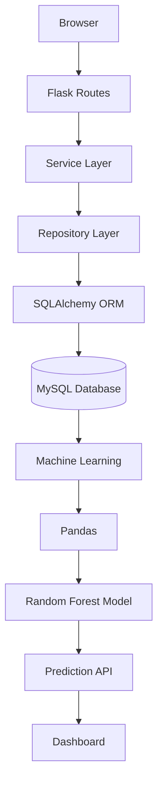

## System Architecture

```mermaid
flowchart TD

A[Browser] --> B[Flask Routes]

B --> C[Service Layer]

C --> D[Repository Layer]

D --> E[SQLAlchemy ORM]

E --> F[(MySQL Database)]

F --> G[Machine Learning]

G --> H[Pandas]

H --> I[Random Forest Model]

I --> J[Prediction API]

J --> K[Dashboard]
```